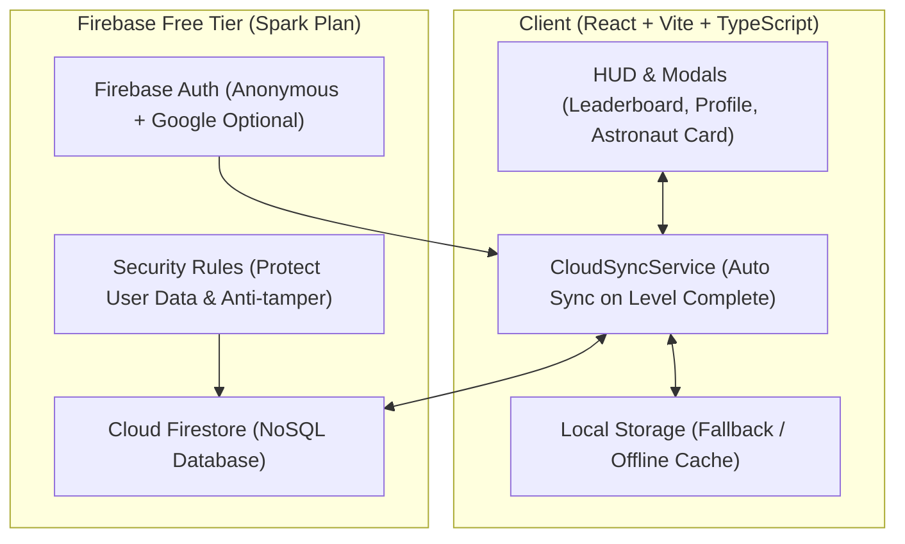

# Vocab Pew Pew — Kế Hoạch & Chi Tiết Triển Khai (Task Breakdown)
## Hệ Thống Lưu Trữ Mây, Bảng Xếp Hạng, Khoe Chiến Tích & Cộng Đồng Học Tập

---

## 📌 Mục Tiêu Tổng Quan
Biến **Vocab Pew Pew** từ một game học từ vựng cá nhân ngoại tuyến (Local Storage) thành một **hệ sinh thái học tập kết nối**:
1. **Lưu trữ đồng bộ đám mây (Cloud Sync)** hoàn toàn miễn phí, an toàn với Firebase Spark Plan.
2. **Bảng Xếp Hạng (Leaderboard)** tạo động lực thi đua học tập lành mạnh theo độ tuổi/Realm và theo tuần.
3. **Khoe chiến tích & vật phẩm (Astronaut Showcase)** cho phép xuất ảnh "Thẻ Căn Cước Phi Hành Gia" để chia sẻ lên Zalo, Facebook.
4. **Cộng đồng học tập (Space Guilds & World Boss)** giúp các bạn nhỏ lập phi đội, săn Boss vũ trụ cùng nhau.

---

## 🏗️ Kiến Trúc Kỹ Thuật (Architecture & Tech Stack)



* **Dịch vụ máy chủ:** Google Firebase (Cloud Firestore & Firebase Authentication) — Gói Spark Miễn Phí trọn đời.
* **Chi phí ước tính:** $0.00 / tháng (Hỗ trợ tốt tới 50.000 lượt đọc và 20.000 lượt ghi mỗi ngày).
* **Bảo vệ dữ liệu trẻ em:** Không bắt buộc nhập Email hay số điện thoại; sử dụng Anonymous Authentication kết hợp định danh ngắn gọn (Friend Code: `#PEW-XXXX`).

---

## 🗄️ Cấu Trúc Dữ Liệu (Firestore Data Schema)

### 1. Collection `users/{uid}` (Hồ sơ người chơi)
```typescript
interface FirestoreUserProfile {
  uid: string;                 // Firebase UID
  playerTag: string;           // Mã phi hành gia hiển thị, ví dụ "PEW-7821"
  userName: string;            // Tên hiển thị (ví dụ "Bé Bắp", "Minh Trí")
  avatar: string;              // Emoji đại diện ("🚀", "🦊", "🐱")
  userAge: number;             // Độ tuổi (7 - 18)
  selectedRealmId: string;     // Cõi thiên hà đang học (realm-1 đến realm-8)
  
  // Điểm số thi đua
  totalXp: number;             // Tổng điểm kinh nghiệm
  starsCount: number;          // Tổng số sao đạt được
  streakDays: number;          // Chuỗi ngày học liên tục 🔥
  wordsMastered: number;       // Số từ vựng đã hoàn thành
  
  // Trang bị hiện tại
  equippedShipId: string;      // ID tàu chiến
  equippedBlasterId: string;   // ID súng bắn
  equippedLaserId: string;     // ID tia laser
  activeTitle: string;         // Danh hiệu: "Xạ Thủ Tập Sự", "Vua Từ Vựng"...
  
  // Thời gian
  lastActiveAt: number;        // Timestamp lần chơi gần nhất
  weeklyXp: number;            // XP kiếm được trong tuần này (reset thứ Hai)
  lastWeeklyReset: string;     // YYYY-WW (năm và tuần)
  createdAt: number;
}
```

### 2. Collection `weekly_leaderboards/{weekId}/ranks/{uid}`
Dùng để tối ưu lượt đọc Firestore, chỉ lưu top 100 người có `weeklyXp` cao nhất của tuần hiện tại.

### 3. Collection `guilds/{guildId}` (Phi đội học tập - Giai đoạn 4)
```typescript
interface FirestoreGuild {
  id: string;
  name: string;                // Tên phi đội: "Chi Đội Sao Hỏa 3A"
  icon: string;                // Biểu tượng phi đội
  leaderUid: string;           // Trưởng phi đội
  memberUids: string[];        // Danh sách thành viên (tối đa 15 bạn)
  totalGuildXp: number;        // Tổng điểm đóng góp của cả nhóm
  weeklyBossDamage: number;    // Sát thương gây ra cho Boss Thế Giới
}
```

---

## 📋 Chi Tiết Phân Rã Từng Nhiệm Vụ (Detailed Task Breakdown)

### 🟢 GIAI ĐOẠN 1: Tích Hợp Firebase & Đồng Bộ Đám Mây (Cloud Sync) — [HOÀN THÀNH ✅]
> **Mục tiêu:** Lưu trữ tiến độ tự động lên server miễn phí, hỗ trợ đa thiết bị và không bị mất dữ liệu khi xóa trình duyệt.

- [x] **Task 1.1: Khởi tạo cấu hình Firebase SDK**
  - Cài đặt thư viện `firebase` vào `package.json`.
  - Tạo tệp `src/services/firebase/firebaseConfig.ts` chứa cấu hình ứng dụng (Environment Variables qua `.env.local` và `.env.example`).
  - Viết fallback an toàn: Nếu chưa cấu hình Firebase key, hệ thống vẫn hoạt động mượt mà ở chế độ LocalStorage offline.

- [x] **Task 1.2: Định danh phi hành gia & Anonymous Authentication**
  - Tạo tệp `src/services/firebase/authService.ts`.
  - Tự động đăng nhập ẩn danh (`signInAnonymously`) khi mở game lần đầu.
  - Sinh mã `playerTag` thân thiện 6 ký tự ngẫu nhiên (ví dụ `#PEW-4921`).
  - Cho phép liên kết Google Sign-in (tuỳ chọn cho phụ huynh nếu muốn đổi máy mà không mất tài khoản).

- [x] **Task 1.3: Dịch vụ đồng bộ dữ liệu hai chiều (`CloudSyncService.ts`)**
  - Tạo tệp `src/services/firebase/cloudSyncService.ts`.
  - Cơ chế đồng bộ: Khi người chơi hoàn thành màn chơi, nhận sao, lên cấp, hoặc đổi tàu vũ trụ:
    1. Ghi tức thì vào `localStorage` (chơi không bị khựng hình).
    2. Đẩy nền (debounced asynchronous write) lên Firestore.
  - Cơ chế hợp nhất dữ liệu (Conflict Resolution): So sánh `lastActiveAt` hoặc lấy điểm số cao nhất giữa Local và Cloud khi mở app trên thiết bị mới.

- [x] **Task 1.4: Thiết lập Security Rules & Chỉ mục Firestore (`firestore.rules`)**
  - Viết tệp quy tắc bảo mật `firestore.rules`.
  - Chỉ cho phép user ghi vào đúng tài liệu `users/{request.auth.uid}` của mình.
  - Giới hạn các trường dữ liệu hợp lệ, ngăn chặn việc sửa hack điểm vô lý (ví dụ: XP không tăng đột biến > 10.000 điểm 1 lúc).

---

### 🟢 GIAI ĐOẠN 2: Hệ Thống Bảng Xếp Hạng (Leaderboard) — [HOÀN THÀNH ✅]
> **Mục tiêu:** Tạo động lực thi đua học tập tích cực, hỗ trợ lọc theo độ tuổi/Realm và bảng thi đua hàng tuần.

- [x] **Task 2.1: Dịch vụ truy vấn Bảng Xếp Hạng (`LeaderboardService.ts`)**
  - Tạo `src/services/firebase/leaderboardService.ts`.
  - Hàm `fetchGlobalLeaderboard(limit = 50)`: Lấy top điểm cao toàn vũ trụ.
  - Hàm `fetchRealmLeaderboard(realmId, limit = 50)`: Lấy top học sinh cùng độ tuổi/cấp độ.
  - Hàm `fetchWeeklyLeaderboard(limit = 50)`: Lấy top chiến thần chăm chỉ trong tuần hiện tại.
  - Tự động hợp nhất thứ hạng của bé và tích hợp danh sách phi hành gia dự phòng (fallback) sinh động khi ngoại tuyến.

- [x] **Task 2.2: Giao diện Modal Bảng Xếp Hạng (`LeaderboardModal.tsx`)**
  - Tạo component `src/components/modals/LeaderboardModal.tsx` với giao diện 3D phong cách Sci-Fi rực rỡ:
    - 3 Tab chuyển đổi: **Chiến Thần Tuần (Weekly)** | **Toàn Vũ Trụ (Global)** | **Cùng Cấp Độ (Realm)**.
    - Top 3 người dẫn đầu được làm nổi bật với bục vinh quang (Huy chương Vàng 🥇 Quán Quân, Bạc 🥈, Đồng 🥉 kèm hào quang & vương miện).
    - Hàng của người chơi hiện tại được ghim cố định ở thanh đáy với hiệu ứng phát sáng đặc biệt.
  - Hiển thị đầy đủ: Thứ hạng, Avatar, Tên, Friend Tag `#PEW-XXXX`, Tàu vũ trụ đang lái, và Tổng XP / Sao / Streak.

- [x] **Task 2.3: Tích hợp nút mở Bảng Xếp Hạng trên TopNavBar & Màn hình Kết Quả**
  - Thêm biểu tượng Cúp Vàng 🏆 trên thanh `TopNavBar.tsx` kèm hiệu ứng động.
  - Sau khi chiến thắng màn chơi ở `VictoryModal.tsx`, hiển thị thẻ thành tích thứ hạng tuần (*"+{xpAwarded} XP đã cộng vào Bảng Xếp Hạng!"*) kèm nút mở nhanh BXH.

---

### 🟢 GIAI ĐOẠN 3: Khoe Chiến Tích & Vật Phẩm (Showcase & Flexing) — [HOÀN THÀNH ✅]
> **Mục tiêu:** Cho phép học sinh tự hào chia sẻ thành tích, vật phẩm tàu vũ trụ đã mở khóa với bạn bè và phụ huynh.

- [x] **Task 3.1: Hệ thống Danh hiệu & Huy hiệu Thành tích (Badges & Titles)**
  - Mở rộng `src/data/progress-types.ts` bổ sung `unlockedBadgeIds`, `selectedBadgeIds`, và `activeTitle`.
  - Tạo danh sách huy hiệu phong phú trong `src/data/badge-data.ts` (16+ huy hiệu đặc biệt, cơ chế tự động mở khóa và trao tặng danh hiệu vũ trụ).
  - Tích hợp kiểm tra và tự động cập nhật danh hiệu/huy hiệu khi mở app và khi chiến thắng màn chơi trong `progressStorage.ts`.

- [x] **Task 3.2: Thẻ Căn Cước Phi Hành Gia (Astronaut Citizen ID Card)**
  - Tạo component `src/components/modals/AstronautCardModal.tsx` với phong cách Hologram không gian rực rỡ:
    - Hiển thị mô hình 2D tàu chiến + màu tia laser + tên súng đang trang bị trực tiếp từ Canvas engine.
    - Tên học sinh + Friend Tag (`#PEW-XXXX`) + Danh hiệu cao quý + Cõi thiên hà.
    - 3 Huy hiệu danh giá nhất người chơi tự do chọn gắn lên ngực áo.
    - Thống kê: Tổng từ vựng đã nắm vững, Số màn 3 sao, Số ngày streak, Tổng điểm XP.

- [x] **Task 3.3: Tính năng 1-Click Xuất Ảnh Khoe Bạn Bè (Share Image Generator)**
  - Tạo dịch vụ `src/services/shareCardGenerator.ts` dùng HTML5 Canvas API thuần (100% không phụ thuộc thư viện nặng, zero lag):
    - Vẽ thẻ với độ phân giải cao 1200x675 HD, đầy đủ hiệu ứng phát sáng, mạch điện sci-fi và con dấu chứng nhận liên đoàn.
    - Nút **"Tải Thẻ Về Máy (PNG)"** cho phép lưu ảnh tức thì.
    - Nút **"Sao Chép Ảnh"** copy trực tiếp vào Clipboard để paste vào Zalo / Messenger.
    - Nút **"Chia Sẻ (Share)"** kích hoạt Web Share API trên điện thoại/máy tính bảng.

- [x] **Task 3.4: Xem Nhà Chứa Tàu của bạn bè (Friend Profile & Hangar View)**
  - Bấm vào bất kỳ bạn nào trên Bảng Xếp Hạng hoặc trên Bục Vinh Quang Top 3 để mở xem Thẻ Căn Cước của bạn ấy.
  - Tích hợp bộ nút tương tác cổ vũ an toàn cho trẻ em (🚀 Bắn Pháo Hoa, ⭐ Tặng Ngôi Sao, 👏 Vỗ Tay Cổ Vũ, 🔥 Tiếp Thêm Lửa) kèm hiệu ứng âm thanh Web Audio sinh động.


---

### 🟠 GIAI ĐOẠN 4: Tạo Cộng Đồng Học Tập & Đam Mê (Study Clans & Co-op)
> **Mục tiêu:** Gắn kết các bạn nhỏ thành nhóm học tập, cùng chinh phục các sự kiện lớn.

- [ ] **Task 4.1: Hệ thống Phi Đội Không Gian (Space Guilds / Study Groups)**
  - Tạo giao diện `GuildModal.tsx`:
    - Tạo Phi Đội (nhập tên lớp/nhóm, ví dụ: *Phi Đội 4A1*, *Cosmic Explorers*).
    - Tham gia Phi Đội bằng mã mời 6 số.
    - Giới hạn nhóm tối đa 15 - 20 thành viên để duy trì không khí ấm cúng.

- [ ] **Task 4.2: Nhiệm vụ Phi Đội & Điểm Đóng Góp (Guild Quests)**
  - Mỗi khi thành viên hoàn thành 1 màn chơi từ vựng, tự động đóng góp điểm năng lượng cho Bình Năng Lượng Phi Đội.
  - Mở khóa rương kho báu chung mỗi tuần (chia đều 💎 Gems cho tất cả thành viên trong nhóm).

- [ ] **Task 4.3: Săn Boss Vũ Trụ Cuối Tuần (Weekend World Boss Raid)**
  - Sự kiện diễn ra từ Thứ 6 đến Chủ Nhật hàng tuần:
    - Một siêu Boss vũ trụ xuất hiện với lượng máu khổng lồ (ví dụ: 100.000 HP).
    - Toàn bộ học sinh trên server mỗi khi bắn đúng từ vựng trong game sẽ gây sát thương tương ứng lên Boss.
    - Khi Boss bị tiêu diệt, tất cả học sinh tham gia được nhận Huy hiệu Đặc biệt và Quà mừng thắng lợi.

- [ ] **Task 4.4: Đường Link Thách Đấu Bất Đồng Bộ (Challenge Link)**
  - Sau khi bắn hoàn thành 1 màn chơi với số điểm cao: Có nút *"Thách đấu bạn bè"*.
  - Sinh đường link rút gọn (ví dụ: `https://vocab-pew-pew.vercel.app/?duel=lvl-1-3&score=1420&from=BéBắp`).
  - Bạn bè bấm vào link sẽ chơi đúng màn đó để xem ai đạt điểm cao hơn.

---

## 🛡️ Nguyên Tắc An Toàn Cho Trẻ Em (Child Safety & Privacy)

| Tiêu Chí | Giải Pháp Triển Khai |
| :--- | :--- |
| **Không yêu cầu thông tin nhạy cảm** | Không thu thập họ tên đầy đủ, trường học chính xác, số điện thoại hay email cá nhân của bé. |
| **Không có tính năng Chat tự do** | Tránh rủi ro bắt nạt hoặc ngôn từ không phù hợp. Chỉ dùng các tương tác biểu cảm nhanh (🚀 High Five, 👏 Chúc Mừng, ⭐ Tuyệt Vời). |
| **Kiểm duyệt tên hiển thị (Bad words filter)** | Tích hợp bộ lọc từ khóa tiếng Việt & tiếng Anh để ngăn chặn việc đặt tên không lành mạnh. |
| **Giới hạn thời gian chơi lành mạnh** | Giữ vững cơ chế Năng Lượng (Energy Limit) hiện có để bảo vệ mắt và sức khỏe trẻ em. |

---

## 🚀 Các Bước Thực Hiện Tiếp Theo (Next Action Steps)

1. [x] Tạo file kế hoạch chi tiết `docs/COMMUNITY_AND_LEADERBOARD_ROADMAP.md`.
2. [ ] **Bước tiếp theo đề xuất:** Bắt đầu với **Giai đoạn 1 (Cài đặt Firebase & CloudSyncService)** hoặc **Giai đoạn 3 (Thẻ Phi Hành Gia & Nút xuất ảnh khoe Zalo/Facebook)**.
