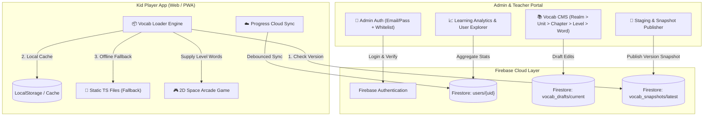

# Specification: Admin Quản Trị Từ Vựng & Analytics Người Dùng Firebase

> **Giai đoạn**: Stage 2 - Design (Spec & Flagged Concerns)  
> **Dự án**: Vocab Pew Pew (`vocab-pew-pew`)  
> **Trạng thái**: Chờ phê duyệt Kiến trúc (Pending Arch Sign-off)  
> **Lựa chọn từ Stage 1**:
> - **Xác thực Admin**: Phương án A (Firebase Auth Email/Password + Whitelist Admin Email/UID)
> - **Cơ chế phát hành từ vựng**: Phương án B (Staging & Publish Snapshot)
> - **Analytics**: Phương án A (Tổng hợp trực tiếp từ collection `users` Firestore)

---

## 1. Tổng quan Kiến trúc (System Architecture)



---

## 2. Đặc tả Chi tiết Phân hệ (Functional Specifications)

### 2.1 Module 1: Xác thực & Điều hướng Admin (Admin Auth & Guard)
- **Đường dẫn truy cập**: Sub-view hoặc link quản trị viên `/admin` (hoặc tổ hợp phím nhanh `Ctrl + Shift + A`).
- **Quy trình đăng nhập (Tinh gọn & Trực tiếp)**:
  1. Bạn tạo sẵn 1 tài khoản Admin trong **Firebase Console $\rightarrow$ Authentication $\rightarrow$ Add User** (Email & Password riêng của bạn).
  2. Trên trang Admin chỉ có màn hình **Đăng Nhập (Sign In)** (không mở form Đăng ký tự do).
  3. Admin nhập `Email` và `Password` $\rightarrow$ Firebase Auth xác thực trực tiếp.
  4. Duy trì phiên làm việc `onAuthStateChanged` với token an toàn.
  5. Có nút **Đăng xuất (Sign Out)** để quay trở về màn hình game của học sinh.

---

### 2.2 Module 2: Quản trị Ngân hàng Từ vựng (Vocabulary CMS)

#### A. Cấu trúc Cây Dữ liệu (Hierarchical Explorer)
Hỗ trợ quản lý 4 cấp độ phân cấp học tập trực quan:
- **Cấp 1: 8 Age Realms** (`Realm 1` $\rightarrow$ `Realm 8` từ Mầm non/Tiểu học đến Công nghệ/Giao tiếp nâng cao).
- **Cấp 2: Units** (Chủ đề bài học, màu sắc nhận diện, icon).
- **Cấp 3: Levels** (Level 1, Level 2... Type: Standard / Speed Rush / Boss Battle / Chest Reward).
- **Cấp 4: Words** (Danh sách từ vựng của level).

#### B. CRUD & Tinh chỉnh Từ vựng (Word Editor Modal)
Mỗi từ vựng (`VocabWord`) hỗ trợ biên tập các trường:
- `id`: Định danh duy nhất (tự động tạo dạng `w-xxxx` hoặc mã tùy chỉnh).
- `word`: Từ tiếng Anh (ví dụ: `galaxy`, `space`).
- `meaningVi`: Nghĩa tiếng Việt chuẩn cho lứa tuổi (ví dụ: `thiên hà`, `vũ trụ`).
- `category`: Nhóm từ vựng (ví dụ: `Astronomy`, `Action`, `Colors`).
- `emoji`: Biểu tượng cảm xúc trực quan (ví dụ: `🌌`, `🪐`).
- `pronunciation`: Phiên âm quốc tế IPA (ví dụ: `/ˈɡæləksi/`).
- **Nút "Nghe thử" (Audio Preview)**:
  - Tích hợp `SpeechHelper.speak(word)` qua Web Speech API (tuân thủ **Zero External Audio** invariant).
  - Cho phép chọn tốc độ đọc (0.8x cho trẻ em, 1.0x chuẩn) để kiểm tra phát âm trước khi lưu.

#### C. Import & Export Hàng loạt (Batch Operations)
- **Export JSON / CSV**: Tải toàn bộ hoặc tải theo Realm file dữ liệu từ vựng.
- **Import JSON / CSV**: Tải lên file bảng từ vựng với tính năng kiểm tra lỗi (Validate format, thiếu nghĩa, trùng ID) trước khi merge vào bản thảo.

---

### 2.3 Module 3: Cơ chế Staging & Phát hành Snapshot (Publish Engine)

Nhằm đảm bảo **tối ưu quota Firestore (Free Tier Friendly)** và độ tin cậy khi học sinh chơi:

```
[Admin Edit Drafts] ──► Firestore: `vocab_drafts/current`
                              │
                    [Admin Click "Publish"]
                              │
                              ▼
                     Generate New Version ID (e.g. v2026.09.14-01)
                     Write to Firestore: `vocab_snapshots/latest`
                              │
                    ┌─────────┴─────────┐
                    ▼                   ▼
         [Client Check Hash]    [No Update Needed]
         Fetch Snapshot once    Use Cached/Local
```

1. **Staging Drafts (`vocab_drafts/current`)**:
   - Khi Admin thêm/sửa/xóa từ vựng, dữ liệu được ghi vào bản nháp `vocab_drafts`.
   - Admin có thể thử nghiệm hoặc xem trước danh sách màn chơi mà chưa làm ảnh hưởng đến học sinh đang chơi thực tế.
2. **Publish Snapshot (`vocab_snapshots/latest`)**:
   - Khi hoàn tất kiểm duyệt, Admin nhấn nút **"🚀 Phát Hành Bản Mới (Publish Snapshot)"**.
   - Hệ thống tạo `versionId` (Timestamp ISO), ghi toàn bộ cấu trúc Realms vào document `vocab_snapshots/latest`.
3. **Client Loader (`vocabLoader.ts`)**:
   - Khi học sinh mở game: Client kiểm tra trường `versionId` của `vocab_snapshots/latest` (1 read duy nhất).
   - Nếu `versionId` mới hơn phiên bản lưu trong `localStorage`: Tải snapshot mới và lưu vào cache.
   - Nếu không có internet hoặc Firestore lỗi: Tự động dùng fallback static từ `src/data/chapters/`.

---

### 2.4 Module 4: Dashboard Thống kê & Quản lý Người học (Analytics & User Explorer)

#### A. Thẻ Chỉ số Tổng quan (Executive KPI Cards)
- **Tổng số Học viên (Total Learners)**: Đếm tổng document trong collection `users`.
- **Học viên Tích cực (Active Learners)**: Số người học có `lastActiveDate` trong 24 giờ qua (DAU) và 7 ngày qua (WAU).
- **Tổng Từ Đã Master (Mastered Words)**: Tổng cộng số từ vựng các học sinh đã học thành thạo.
- **Tổng Sao & XP (Stars & XP Economy)**: Tổng sao và điểm kinh nghiệm toàn hệ thống.

#### B. Biểu đồ & Báo cáo Phân bổ
- **Phân bổ học viên theo 8 Realm**: Thống kê số lượng người học đang ở Realm nào (phát hiện Realm nào đông nhất hoặc Realm nào học sinh dễ dừng lại).
- **Phân bổ Linh thú (Mascot) & Giao diện (Theme)**: Thống kê sở thích của học sinh (Cosmo Dog, Luna Cat, Sakura, Cosmic Cyan...).

#### C. Bảng Quản lý Học viên (User Explorer Table)
- Bảng phân trang danh sách người dùng với các cột:
  - `Avatar` & `Player Tag` (Mã phi hành gia).
  - `Tên học viên` & `Độ tuổi`.
  - `Realm hiện tại` & `Cấp độ / Màn chơi`.
  - `Tổng XP` & `Số sao ⭐`.
  - `Chuỗi ngày học 🔥 (Streak)`.
  - `Lần cuối hoạt động (Last Active)`.
- Thanh tìm kiếm theo tên hoặc Player Tag.
- Modal xem nhanh chi tiết tiến độ từng Realm của học sinh.

---

## 3. Cấu trúc Dữ liệu Firestore (Database Schemas)

### A. Collection `vocab_drafts/current`
```typescript
interface VocabDraftDoc {
  updatedAt: Timestamp;
  updatedBy: string; // admin email/uid
  realms: AgeRealm[];
}
```

### B. Collection `vocab_snapshots/latest`
```typescript
interface VocabSnapshotDoc {
  versionId: string;       // e.g. "v2026.09.14_01"
  publishedAt: Timestamp;
  publishedBy: string;
  totalWords: number;
  totalLevels: number;
  realms: AgeRealm[];
}
```

### C. Collection `users/{uid}` (Dữ liệu sẵn có từ Cloud Sync)
```typescript
interface UserCloudDoc {
  uid: string;
  playerTag: string;
  userName: string;
  avatar: string;
  userAge: number;
  selectedRealmId: string;
  currentLevelId: string;
  totalXp: number;
  weeklyXp: number;
  starsCount: number;
  completedLevelsCount: number;
  streakDays: number;
  wordsMastered: number;
  lastActiveDate?: string;
  updatedAt: Timestamp;
}
```

---

## 4. UI/UX & Responsive Layouts (Theo Kid Arcade & Responsive Standards)

### A. Bố cục Giao diện Admin (Space Commander Theme)
- **Top Navigation Bar**:
  - Logo *Vocab Pew Pew - Mission Control 🛡️*.
  - Tab chuyển đổi: **[📚 Quản Lý Từ Vựng]** | **[📈 Thống Kê & Báo Cáo]** | **[👥 Danh Sách Học Viên]**.
  - Trạng thái Sync / Version hiện tại (`Snapshot: v2026.09.14_01`).
  - Nút **[🚀 Phát Hành Bản Mới]** (Màu cam dạ quang nổi bật) & Nút **[Đăng xuất]**.
- **Vocab Editor View**:
  - Cột trái (Sidebar 280px / Accordion trên Mobile): Cây danh mục 8 Realm & Units.
  - Vùng chính: Grid thẻ bài các Levels và danh sách từ vựng.
  - Nút thêm từ mới dạng 3D Button tactile (`btn-3d-cyan`).
- **Analytics View**:
  - 4 KPI Widget cards hiệu ứng Glassmorphism neon.
  - Biểu đồ thanh phân bổ Realm trực quan với màu sắc đặc trưng của 8 Realm.
  - Bảng danh sách học viên hỗ trợ cuộn mượt và responsive trên iPad (tối thiểu chạm 44px).

---

## 5. Cảnh báo Chính sách & Rủi ro Kỹ thuật (Flagged Concerns & Mitigation)

> [!CAUTION]
> **1. Bảo mật Trẻ em (COPPA & GDPR-K Compliance)**
> - Không lưu trữ bất kỳ thông tin nhận dạng cá nhân nhạy cảm (PII) nào của học sinh như số điện thoại, email trẻ em hay vị trí địa lý.
> - Bảng danh sách học viên chỉ hiển thị biệt danh `userName`, `playerTag`, `avatar` và số liệu học tập.

> [!WARNING]
> **2. Kiểm soát Hạn ngạch Firestore (Quota Budgeting)**
> - Bảng Analytics và User Explorer phải sử dụng `limit(50)` và phân trang (`startAfter`), không truy vấn toàn bộ collection `users` trong 1 lần.
> - Client học sinh **chỉ đọc 1 document duy nhất** (`vocab_snapshots/latest`) khi khởi động và cache vĩnh viễn cho đến khi có versionId mới.

> [!IMPORTANT]
> **3. Đảm bảo Bất biến Âm thanh (Audio Invariant)**
> - Tuyệt đối không import file mp3/wav khi biên tập từ vựng. Mọi phát âm từ vựng sử dụng Web Speech API chuẩn trình duyệt.

---

## 6. Kế hoạch Kiểm thử & Nghiệm thu (Verification & Acceptance Criteria)

- [ ] **Auth Gate**: Đăng nhập bằng tài khoản không có trong whitelist bị từ chối; tài khoản admin đăng nhập thành công.
- [ ] **Vocab CRUD**: Thêm, sửa, xóa từ vựng trong Realm hoạt động trơn tru; phát âm Web Speech API rõ ràng.
- [ ] **Publish & Fallback**: Bấm Publish tạo snapshot mới; Client offline vẫn chơi tốt từ dữ liệu tĩnh, online nhận dữ liệu snapshot mới.
- [ ] **Analytics Accuracy**: Hiển thị chính xác tổng số học viên, phân bổ Realm và danh sách học viên từ Firestore.
- [ ] **Type & Build Check**: `npm run build` hoàn thành với 0 type error và 0 lint warning.
