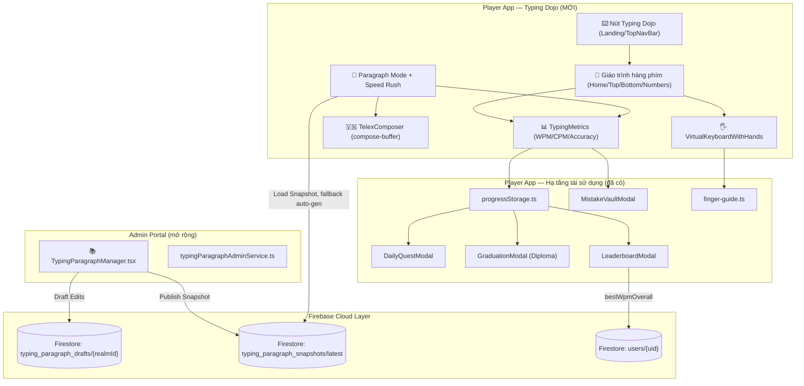

# Specification: Typing Dojo — Module Luyện Gõ 10 Ngón Độc Lập

> **Giai đoạn**: Stage 2 - Design (Spec & Flagged Concerns)
> **Dự án**: Vocab Pew Pew (`vocab-pew-pew`)
> **Trạng thái**: Chờ phê duyệt Kiến trúc (Pending Arch Sign-off)
> **Lựa chọn từ Stage 1** (xem `intent.md`):
> - **Vị trí**: Mode độc lập "⌨️ Typing Dojo", không nhúng vào Saga Map
> - **WPM**: Chuẩn ngành `(ký tự đúng / 5) / phút`
> - **Tiếng Việt**: Có, bộ gõ **Telex**
> - **Unlock**: Mở ngay từ đầu, không phụ thuộc tiến độ Saga Map
> - **Nguồn đoạn văn**: Tự sinh từ `chapters/`, Admin sửa/xoá/thêm qua Portal
> - **Ngưỡng diploma**: Lấy cận dưới của `AgeRealm.targetWpm` đã có sẵn trong code (xem bảng ở `intent.md` mục 6)

---

## 1. Tổng quan Kiến trúc (System Architecture)


```mermaid
graph TD
    subgraph "Player App — Typing Dojo (MỚI)"
        Entry["⌨️ Nút Typing Dojo (Landing/TopNavBar)"]
        Curriculum["📖 Giáo trình hàng phím (Home/Top/Bottom/Numbers)"]
        Keyboard["🖐️ VirtualKeyboardWithHands"]
        Paragraph["📝 Paragraph Mode + Speed Rush"]
        Telex["🇻🇳 TelexComposer (compose-buffer)"]
        Metrics["📊 TypingMetrics (WPM/CPM/Accuracy)"]
    end

    subgraph "Player App — Hạ tầng tái sử dụng (đã có)"
        Progress["progressStorage.ts"]
        DailyQuest["DailyQuestModal"]
        Graduation["GraduationModal (Diploma)"]
        LeaderboardUI["LeaderboardModal"]
        MistakeVault["MistakeVaultModal"]
        FingerGuide["finger-guide.ts"]
    end

    subgraph "Admin Portal (mở rộng)"
        ParagraphMgr["📚 TypingParagraphManager.tsx"]
        ParagraphSvc["typingParagraphAdminService.ts"]
    end

    subgraph "Firebase Cloud Layer"
        FStoreDrafts[("Firestore: typing_paragraph_drafts/{realmId}")]
        FStoreSnapshots[("Firestore: typing_paragraph_snapshots/latest")]
        FStoreUsers[("Firestore: users/{uid}")]
    end

    Entry --> Curriculum
    Curriculum --> Keyboard
    Keyboard --> FingerGuide
    Curriculum --> Metrics
    Paragraph --> Metrics
    Paragraph --> Telex
    Metrics --> Progress
    Progress --> DailyQuest
    Progress --> Graduation
    Progress --> LeaderboardUI
    Metrics --> MistakeVault

    ParagraphMgr -->|Draft Edits| FStoreDrafts
    ParagraphMgr -->|Publish Snapshot| FStoreSnapshots
    Paragraph -->|Load Snapshot, fallback auto-gen| FStoreSnapshots
    LeaderboardUI -->|bestWpmOverall| FStoreUsers
```

---

## 2. Đặc tả Chi tiết Phân hệ (Functional Specifications)

### 2.1 Điểm vào & Điều hướng (Entry Point)
- Nút **"⌨️ Typing Dojo"** đặt cạnh nút vào Saga Map ở `LandingPage.tsx` và trong `TopNavBar.tsx` (khi đang ở Saga Map, cho phép chuyển nhanh sang Dojo và ngược lại).
- Không yêu cầu điều kiện mở khoá (theo quyết định Stage 1).
- Ghi nhớ tab cuối cùng người dùng chọn (`lastActiveMode: 'saga' | 'dojo'`) trong `progressStorage.ts` để mở lại đúng chỗ lần sau — có fallback mặc định `'saga'` khi field chưa tồn tại.

### 2.2 Giáo trình gõ 10 ngón (Structured Curriculum)
Định nghĩa trong `src/data/typing-curriculum.ts`, không phụ thuộc `chapters/`:

| Thứ tự | rowType | Nội dung luyện |
|---|---|---|
| 1 | `home` | `a s d f g h j k l ;` (kèm nhắc "Phím tổ ấm") |
| 2 | `top` | `q w e r t y u i o p` |
| 3 | `bottom` | `z x c v b n m , . /` |
| 4 | `numbers` | `1 2 3 ... 0` và ký tự Shift phổ biến |
| 5 | `short_words` | Từ ngắn 3-5 ký tự ghép từ các phím đã học (tái dùng ngữ liệu, không phải từ vựng chủ đề) |
| 6 | `paragraph` | Chuyển sang Paragraph Mode (mục 2.4) |

- Mỗi bài học có `minAccuracyToPass` (mặc định 80%) để mở khoá bài tiếp theo — không dùng hearts/gems của Saga Map, chỉ pass/fail đơn giản, tránh gây áp lực thất bại kiểu game bắn từ.
- Bài học không phân theo Realm — dùng chung cho mọi lứa tuổi (đúng quyết định Stage 1).

### 2.3 Bàn phím ảo có ngón tay (VirtualKeyboardWithHands)
- Component mới `src/components/typing/VirtualKeyboardWithHands.tsx`, SVG thuần (không audio/asset ngoài — tuân thủ Zero External Audio Invariant).
- Vẽ 2 bàn tay cách điệu phía dưới bàn phím; ngón tay cần dùng cho phím tiếp theo được tô sáng theo `colorName`/`dotColorHex` đã có sẵn trong `finger-guide.ts` — **tái sử dụng 100% dữ liệu hiện có, không viết lại bảng map phím**.
- Phím Home Row (F, J) luôn có dấu chấm nổi bật nhắc "vị trí gờ nổi", đồng bộ với `homeKeyBadge` đã có.
- Trạng thái phím: `idle` → `next-to-press` (sáng + rung nhẹ animation) → `correct` (xanh chớp) → `wrong` (đỏ chớp, không chặn gõ tiếp, chỉ ghi nhận lỗi).

### 2.4 Chế độ gõ theo đoạn văn (Paragraph Mode) & Speed Rush
- `ParagraphTypingView.tsx`: hiển thị đoạn văn cố định, con trỏ (caret) nhảy theo ký tự đã gõ đúng, tô đỏ ký tự sai, cho phép Backspace sửa (không tính lỗi kép khi đã sửa).
- Nguồn đoạn văn: `getActiveTypingParagraphs(realmId)` — ưu tiên snapshot từ Firestore (`typing_paragraph_snapshots/latest`), fallback tự sinh runtime nếu offline (xem 2.7).
- **Speed Rush gõ câu**: biến thể tính giờ 60s, đo WPM/Accuracy thay vì combo điểm; dùng chung `TypingMetrics.ts`.
- Tuân thủ **Animation Loop Idempotency**: nếu Speed Rush dùng `requestAnimationFrame` đếm ngược, việc kết thúc phiên & chấm điểm phải dùng `useRef` guard đồng bộ, không dùng `setTimeout` đơn thuần (giống nguyên tắc đã áp dụng cho `handleVictory`).

### 2.5 Bộ gõ tiếng Việt — Telex Composer
Module mới `src/game/engine/TelexComposer.ts`, hoạt động như một compose-buffer nhận từng keystroke và trả về ký tự hiển thị hiện tại. **Không cần mở rộng `finger-guide.ts` thêm phím mới** — vì Telex chỉ dùng lại các phím chữ cái A-Z sẵn có (`s f r x j` cho dấu thanh, `a a`/`e e`/`o o`/`w`/`d d` cho ký tự biến âm), nên bảng ngón tay hiện tại áp dụng nguyên vẹn.

Luật composition cốt lõi:

| Gõ | Kết quả | Ghi chú |
|---|---|---|
| `as`, `af`, `ar`, `ax`, `aj` | `á`, `à`, `ả`, `ã`, `ạ` | Dấu thanh áp cho nguyên âm gần nhất |
| `aa` | `â` | Áp dụng tương tự cho `ee → ê`, `oo → ô` |
| `aw` | `ă` | |
| `ow`, `w` (sau `u`/đứng riêng) | `ơ`, `ư` | Theo bảng Telex chuẩn |
| `dd` | `đ` | |
| Gõ sai/không khớp quy tắc | Giữ nguyên ký tự đã gõ | Không "nuốt" phím để tránh gây khó hiểu cho trẻ |
| `Backspace` | Hoàn tác bước biến đổi gần nhất trước, không xoá thẳng cả cụm | Vd gõ nhầm `as` → Backspace trả về `a`, không xoá cả chữ trước đó |
| `Space`/dấu câu | Reset buffer, chốt từ hiện tại | Đúng hành vi bộ gõ Telex thật (Unikey-style) |

- `TelexComposer` là **module thuần logic, không đụng `InputHandler.ts` của Saga Map** (Separation of Concerns) — chỉ được `ParagraphTypingView.tsx` gọi khi `isVietnameseMode === true`.
- Cờ bật/tắt chế độ tiếng Việt để ở cấp Paragraph Mode (mỗi đoạn văn có field `isVietnamese`), không phải cấp toàn app.

### 2.6 Đo lường Tốc độ & Độ chính xác (TypingMetrics)
`src/game/engine/TypingMetrics.ts` — dùng chung cho Curriculum, Paragraph Mode, Speed Rush:
- `startSession()`, `recordKeystroke(expectedChar, actualChar, timestampMs)`.
- `computeWpm(correctChars, elapsedMs) = (correctChars / 5) / (elapsedMs / 60000)` (đã chốt Stage 1).
- `computeAccuracy(correctChars, totalKeystrokes) = correctChars / totalKeystrokes * 100`.
- `getTopMistakeKeys(limit)`: trả về danh sách phím hay gõ sai nhất trong phiên, để hiển thị ở MistakeVault (mục 2.8).
- **Nguồn ngưỡng mục tiêu**: đọc trực tiếp `AgeRealm.targetWpm` (parse cận dưới của chuỗi, vd `'25 - 35 WPM'` → `25`) — không hard-code lại bảng riêng (theo phát hiện ở `intent.md` mục 6), đảm bảo một nguồn dữ liệu duy nhất.

### 2.7 Đoạn văn luyện tập — Tự sinh & Quản trị Admin
- **Tự sinh (client-side, không cần LLM/API ngoài)**:
  - Với Realm 1-6 (từ vựng đơn): ghép 4-6 từ đã học trong level theo template câu đơn giản tăng dần độ dài theo `wordLengthHint` của Realm, vd: `"I can see a {word}. It is {emoji}."`.
  - Với Realm 7-8 (từ vựng vốn đã là câu giao tiếp dài, theo `wordLengthHint: 'Câu giao tiếp 20-65+ chữ cái'`): nối trực tiếp 2-3 "word" (thực chất là câu) trong cùng level thành 1 đoạn hội thoại ngắn — không cần template.
  - Hàm `generateParagraphsFromRealm(realm: AgeRealm): TypingParagraph[]` chạy hoàn toàn client-side, dùng làm fallback offline **và** làm dữ liệu khởi tạo cho Admin chỉnh sửa.
- **Quản trị tại Admin Portal** (mở rộng, tái dùng pattern Staging & Publish của Vocab CMS):
  - Tab mới **"📝 Đoạn Văn Luyện Gõ"** trong `AdminPortal.tsx`.
  - `TypingParagraphManager.tsx`: liệt kê đoạn văn theo Realm, nút "Tự sinh lại từ Realm", sửa trực tiếp trong textarea, thêm/xoá đoạn văn thủ công, đánh dấu `isVietnamese`.
  - `typingParagraphAdminService.ts`: `loadDraft()`, `saveDraft()`, `publishSnapshot()` — theo đúng luồng `vocab_drafts` → `vocab_snapshots` đã có, áp dụng cho `typing_paragraph_drafts/{realmId}` → `typing_paragraph_snapshots/latest`.
  - Client (`vocabLoader.ts`-style loader mới `typingParagraphLoader.ts`) kiểm tra `versionId` 1 lần khi mở Typing Dojo, cache `localStorage`, fallback tự sinh khi offline — **giữ nguyên tinh thần Quota Budgeting đã áp dụng cho Vocab**.

### 2.8 Gắn vào vòng lặp thưởng đã có (Reuse, không xây mới)
- **Daily Quest**: thêm 1 mục tuỳ chọn vào `DailyQuestProgress` — `typingSessionCompleted: boolean` ("Hoàn thành 1 phiên Typing Dojo hôm nay"). Không dùng ngưỡng WPM cố định cho quest hằng ngày vì WPM biến thiên nhiều theo phiên, dễ gây nản.
- **Diploma "Chứng Chỉ Gõ 10 Ngón"**: thêm nhánh mới trong `GraduationModal.tsx`, điều kiện `bestWpmOverall(realmId) >= parseTargetWpmFloor(realm.targetWpm) && bestAccuracyOverall(realmId) >= threshold` (bảng ngưỡng ở `intent.md` mục 6).
- **Leaderboard "Tốc độ gõ"**: thêm `LeaderboardCategory = 'typing_speed'` vào `leaderboardService.ts`, sắp xếp theo `bestWpmOverall` — tái dùng nguyên vẹn cơ chế `mergeCurrentUser`/`blendMockContenders`/`deduplicateLeaderboardEntries` đã có, chỉ đổi `sortKey`.
- **MistakeVault**: `MistakeVaultModal.tsx` thêm tab "Phím hay gõ sai" hiển thị kết quả từ `TypingMetrics.getTopMistakeKeys()`, song song tab "Từ hay sai" hiện tại.

---

## 3. Cấu trúc Dữ liệu (Data Schemas)

### A. `src/data/typing-progress-types.ts` (MỚI)
```typescript
export interface TypingLessonProgress {
  lessonId: string;
  isCompleted: boolean;
  bestWpm: number;
  bestAccuracy: number;
  attempts: number;
  lastPlayedAt?: number;
}

export interface TypingWpmHistoryEntry {
  date: string;   // YYYY-MM-DD
  wpm: number;
  accuracy: number;
}

export interface TypingProgress {
  lastActiveMode?: 'saga' | 'dojo';
  lessonProgressMap: Record<string, TypingLessonProgress>;
  bestWpmOverall: number;
  bestAccuracyOverall: number;
  wpmHistory: TypingWpmHistoryEntry[];       // cap 30 entries gần nhất
  keyMistakeMap: Record<string, number>;      // key -> số lần gõ sai
  earnedTypingDiplomaRealmIds: string[];      // Realm đã đạt diploma gõ phím
  vietnameseModeUnlocked: boolean;            // mặc định true, để mở khả năng khoá sau này
}
```
- Gắn vào `UserProgress` (`progress-types.ts`) dưới dạng field mới **optional**: `typingProgress?: TypingProgress` — đúng nguyên tắc Progress & Storage Resilience (luôn `?? DEFAULT_TYPING_PROGRESS` khi đọc từ `localStorage` cũ).

### B. `src/data/typing-curriculum.ts` (MỚI)
```typescript
export type TypingRowType = 'home' | 'top' | 'bottom' | 'numbers' | 'short_words' | 'paragraph';

export interface TypingLesson {
  id: string;             // 'typing-lesson-1'
  order: number;
  rowType: TypingRowType;
  title: string;
  titleVi: string;
  keys: string[];         // các phím trọng tâm của bài
  practiceText: string;   // chuỗi luyện gõ tạo sẵn
  minAccuracyToPass: number; // mặc định 80
}
```

### C. `src/data/typing-paragraph-types.ts` (MỚI)
```typescript
export interface TypingParagraph {
  id: string;
  realmId: string;         // 'realm-1' .. 'realm-8'
  text: string;
  isVietnamese: boolean;
  sourceWordIds: string[]; // truy vết từ vựng nguồn để regenerate
  createdBy: 'auto' | 'admin';
  updatedAt: number;
}
```

### D. Firestore Collections (MỚI, theo pattern Vocab)
```typescript
// typing_paragraph_drafts/{realmId}
interface TypingParagraphDraftDoc {
  updatedAt: Timestamp;
  updatedBy: string;
  paragraphs: TypingParagraph[];
}

// typing_paragraph_snapshots/latest
interface TypingParagraphSnapshotDoc {
  versionId: string;
  publishedAt: Timestamp;
  publishedBy: string;
  paragraphsByRealm: Record<string, TypingParagraph[]>;
}
```

### E. Mở rộng `users/{uid}` (Cloud Sync hiện có)
Thêm 2 field không phá cấu trúc cũ: `bestWpmOverall?: number`, `bestAccuracyOverall?: number` — dùng cho leaderboard tốc độ gõ, ghi qua `cloudSyncService.ts` hiện có (debounced sync).

---

## 4. UI/UX & Responsive Layouts

- **Nút vào Typing Dojo**: đặt cạnh nút "Bắt Đầu Phiêu Lưu" ở `LandingPage.tsx`, cùng phong cách 3D button, icon `⌨️`, màu accent riêng (đề xuất tím `violet` để phân biệt trực quan với cyan của Saga Map).
- **Màn hình Curriculum**: layout dọc — đoạn text luyện gõ ở trên (font monospace lớn, dễ đọc), `VirtualKeyboardWithHands` cố định ở dưới, thanh tiến độ bài học ngang trên cùng.
- **Paragraph Mode**: đoạn văn hiển thị dạng "teleprompter" cuộn nhẹ, ký tự hiện tại có caret nhấp nháy, ký tự sai tô đỏ nhạt + gạch chân sóng.
- **Kết quả cuối phiên**: modal tái dùng phong cách `VictoryModal.tsx` (pháo hoa, Cosmo chúc mừng) nhưng hiển thị WPM/Accuracy thay vì điểm combo.
- Đảm bảo `VirtualKeyboardWithHands` responsive tốt trên iPad (theo Kid-Friendly UX Invariant), touch target tối thiểu 44px như chuẩn hiện tại của `VirtualKeyboard.tsx`.

---

## 5. Cảnh báo Chính sách & Rủi ro Kỹ thuật (Flagged Concerns & Mitigation)

> [!WARNING]
> **1. Độ phức tạp của Telex Composer dễ gây bug tinh vi**
> - Composition có nhiều trường hợp biên (gõ nhanh, gõ sai giữa chừng, Backspace giữa cụm biến âm). Cần bộ unit test riêng (`src/tests/telexComposer.test.ts`) phủ tối thiểu các case trong bảng luật ở mục 2.5 trước khi tích hợp UI.

> [!CAUTION]
> **2. Không phá vỡ luồng gõ hiện tại của Saga Map**
> - `TelexComposer.ts`/`TypingMetrics.ts` phải là module hoàn toàn mới, không import ngược vào `InputHandler.ts`/`EnemySpawner.ts`. Mọi thay đổi ở `App.tsx` để thêm route Typing Dojo phải giữ nguyên hành vi Saga Map hiện tại (regression risk thấp nhưng cần test thủ công đầy đủ Saga Map sau khi tích hợp).

> [!WARNING]
> **3. Quota Firestore cho collection mới**
> - Giống Vocab CMS: client chỉ đọc **1 document duy nhất** (`typing_paragraph_snapshots/latest`) mỗi khi mở Typing Dojo, cache `localStorage`, không query theo Realm riêng lẻ trên Firestore.

> [!IMPORTANT]
> **4. Đảm bảo Bất biến Âm thanh & Kid-Friendly**
> - Âm thanh gõ phím (tick nhẹ mỗi keystroke, chuông khi hoàn thành bài) tổng hợp qua `SoundController.ts` hiện có, không thêm asset mp3.
> - Không dùng cơ chế trừ tim/mạng (hearts) trong Typing Dojo — chỉ pass/fail nhẹ nhàng, tránh nhân đôi áp lực với Saga Map.

---

## 6. Kế hoạch Kiểm thử & Nghiệm thu (Verification & Acceptance Criteria)

- [ ] **Curriculum Flow**: Hoàn thành lần lượt Home → Top → Bottom → Numbers → Short Words mở khoá đúng thứ tự; dưới ngưỡng `minAccuracyToPass` không cho qua bài.
- [ ] **Virtual Keyboard Hands**: Ngón tay sáng đúng theo `finger-guide.ts` cho từng phím kế tiếp, kể cả tổ hợp Telex (`s, f, r, x, j, w, d`).
- [ ] **Telex Composer Unit Tests**: `npm run test` phủ đầy đủ bảng luật mục 2.5 (bao gồm case Backspace hoàn tác đúng 1 bước).
- [ ] **Paragraph Mode**: Gõ đúng/sai highlight chính xác theo từng ký tự; WPM/Accuracy tính đúng công thức chuẩn.
- [ ] **Đồng bộ Admin → Client**: Admin sửa & Publish đoạn văn → Client nhận đúng snapshot mới; offline vẫn tự sinh đoạn văn fallback không bị crash.
- [ ] **Reward Integration**: Diploma gõ phím chỉ cấp khi đạt đủ cả WPM lẫn Accuracy theo bảng Realm; Leaderboard tốc độ gõ sắp xếp đúng theo `bestWpmOverall`; Daily Quest ghi nhận đúng khi hoàn thành 1 phiên Typing Dojo.
- [ ] **Regression Saga Map**: Toàn bộ luồng gõ để bắn từ vựng cũ (InputHandler, EnemySpawner, MistakeVault theo từ) hoạt động y nguyên sau khi tích hợp Typing Dojo.
- [ ] **Type & Build Check**: `npm run build` (`tsc && vite build`) hoàn thành với 0 type error.
